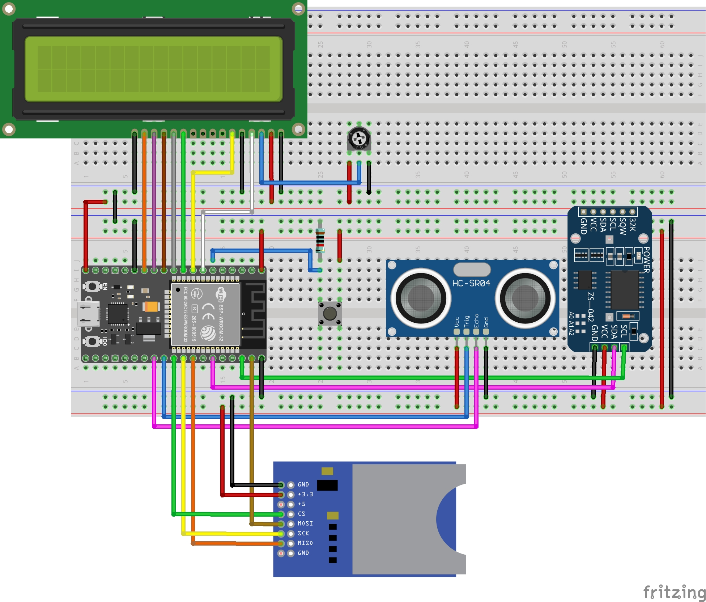

# ESP32-SD-Card-Logger

Logger for ESP32 with RTC, LCD and Ultrasonic-sensor.
The Logger writes the data into a .txt file onto the SD-Card with a timestamp.

## Circuit

Built on <a href="https://www.az-delivery.de/products/esp32-dev-kit-c-v4-unverlotet">ESP32-wroom-32 from AZ-Delivery</a>

## Parts

- <a href="https://www.az-delivery.de/products/3er-set-hc-sr04-ultraschallmodule">Ultrasonic-Sensor (HC-SR04)</a>
- <a href="https://www.amazon.de/-/en/SUNFOUNDER-SD-Card-Module-Arduino/dp/B07R6HQGS1/ref=sr_1_4?crid=2JJTJ383MF7DM&keywords=sd-kartenmodul&qid=1670612869&sprefix=sd-card+module%2Caps%2C134&sr=8-4">SD-Card Module(full size SD)</a>
- <a href="https://www.az-delivery.de/products/16x2-lcd-blaues-display">LCD 16x2</a>
- <a href="https://www.az-delivery.de/products/ds3231-real-time-clock">RTC (DS3231)</a>
- <a href="https://www.az-delivery.de/products/esp32-dev-kit-c-v4-unverlotet">ESP32-wroom-32</a>

## Warning

- The RTC Time isnt adjusted at the start!!
- The Pins on the ESP-32 may be different on other ESP-32 versions

## TO-DO

- Detect voltage Drop(integrate Voltage-Sensor for Battery pack)
- Show SD Storage Usage on Screen
- Button to swap LCD Menu
- Code efficency/energy efficency
- Detect spikes/wrong values from Ultrasonic-Sensor
- Show SD-Card Errors On Screen
- Write important events to log (interrupts, Errors, Storage usage information, Voltage, Suspect values)
- Change Ultrasonic-Sensor to US-100
- add Deep-Sleep for minimal power consumption
